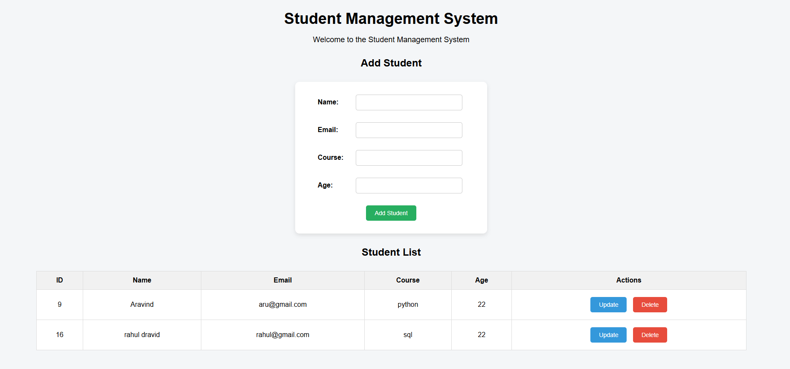

# Student Management System

A full-stack Student Management System built using Spring Boot, MySQL, HTML, CSS, and JavaScript. The application allows users to add, view, update, and delete student records through a simple web interface.

## Features

- Add new student records
- View all student records
- Update student information
- Delete student records
- Input validation
- Exception handling
- RESTful APIs
- MySQL database integration
- Simple and responsive web interface

## Technologies Used

- Java 21
- Spring Boot 4.1.1
- Spring Data JPA
- MySQL 8.0.46
- HTML5
- CSS3
- JavaScript
- REST API
- Maven
- Git
- GitHub

## Project Structure

```text
studentmanagement/
├── src/
│   ├── main/
│   │   ├── java/
│   │   │   └── com.example.studentmanagement/
│   │   │       ├── StudentmanagementApplication.java
│   │   │       ├── controller/
│   │   │       │   ├── package-info.java
│   │   │       │   └── StudentController.java
│   │   │       ├── entity/
│   │   │       ├── exception/
│   │   │       ├── repository/
│   │   │       └── service/
│   │   └── resources/
│   │       ├── static/
│   │       ├── templates/
│   │       └── application.properties
│   └── test/
│       └── java/
│           └── com.example.studentmanagement/
├── pom.xml
├── mvnw
├── mvnw.cmd
├── HELP.md
└── README.md
```

## How to Run the Project

### Prerequisites

Make sure the following are installed:

- Java 21
- MySQL 8.0 or later
- Git
- Maven (or use the included Maven Wrapper)

### Steps

1. Clone the repository:

```bash
git clone https://github.com/aravind268/student-management-system.git
```
2. Open the project in Eclipse, Spring Tool Suite, or any Java IDE.

3. Create the MySQL database:

```sql
CREATE DATABASE studentmanagement;
```

4. Set the database password using the `DB_PASSWORD` environment variable.

5. Run the Spring Boot application.

6. Open the application in your browser:

```text
http://localhost:8080
```

## API Endpoints

| Method | Endpoint | Description |
|--------|----------|-------------|
| GET | `/students` | Get all students |
| GET | `/students/{id}` | Get a student by ID |
| POST | `/students` | Add a new student |
| PUT | `/students/{id}` | Update a student |
| DELETE | `/students/{id}` | Delete a student |

## Screenshots

### Student Management System



